<h2 align="center">💫 Sobre Mim</h2>

  Olá! :wave: Me chamo Bianco e sou estudante de Engenharia de Software. Meu foco é em desenvolvimento back-end. 
  Hello there! :D My name is Bianco and I'm a Software Engineering Student. My main focus is in back-end development.

    

  

 

<h2 align="center">🌐 Conecte-se comigo</h2>

  
  

 

<h2 align="center">💻 Minhas Skills</h2>

  <strong>Linguagens:</strong> 
  
  
  

  <strong>Banco de Dados:</strong> 
  
  

  <strong>Ferramentas & Outros:</strong> 
  
  
  
  

 

<h2 align="center">📖 Estudando Atualmente</h2>

  
  
  
  
  

 

<h2 align="center">📊 GitHub Stats</h2>

<table width="100%">
  <tr>
    <td width="50%" valign="top">
      
    </td>
    <td width="50%" valign="top">
      
    </td>
  </tr>
</table>

 

<h2 align="center">📈 Minhas Contribuições</h2>

  

